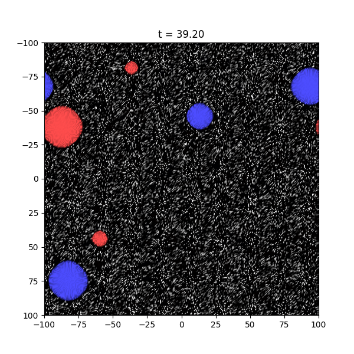

# latbubble
Authors: Tomasz P. Dutka

`latbubble` is a Python framework for simulating thermal first-order phase transitions 
of scalar fields in 3+1 dimensions. It was designed so that real, dynamical bubble nucleation 
can emerge entirely from thermal fluctuations, allowing one to distinguish between different 
transition types: first-order, crossover, or spinodal.

In addition, `latbubble` can study properties of the **critical (unstable) bubble** 
by defining a “separatrix” time step statistcally where the field configuration has equal chance to 
shrink or grow. This enables direct comparison between empirical critical bubbles and theoretical 
profiles.

A representative (Euclidean) Lagrangian often used in `examples/` is

to study a model of a single real scalar field with an adjustable barrier width between the false and true
vacuum. The fate of the phase transitions in this model were studied in [JHEP 05 (2025) 182](https://doi.org/10.1007/JHEP05(2025)182). 
Other potentials can be implemented by modyfying the source.

The code has since been further developed and used to study critical bubble dynamics,
for the same Lagrangian, in an upcoming paper.

This code has been able to reproduce some of the results of the 1+1 dimensional Langevin 
simulation found in [2407.06263](https://arxiv.org/abs/2407.06263).

## Requirements

- [NumPy](https://numpy.org/)
- [Matplotlib](https://matplotlib.org/)
- [h5py](https://www.h5py.org/)

`latbubble` has been tested with Python 3.10+.

## Installation

Clone the repository and install with pip:
```
git clone https://github.com/your-username/latticesim.git
cd latbubble
pip install .
```

For development (changes reflected immediately without reinstalling):
```
pip install -e .
```

## Directory structure
The directory structure is:

- `examples/` - runnable scripts for full simulations, bubble tracking, and subsimulations
- `src/core` - core physics components: counterterms, integrators, Laplacians
- `src/utils/` - utilities for plotting, histogramming, I/O, and noise generation
- `figs/`- figures

## Running

Adjust parameters (lattice size, integrator, Laplacian, etc.) inside the example scripts, then run:
```
python examples/simulation_with_plotting.py
```
which can generate a full lattice simulation including 2D plotting of particular z_slices using custom colour schemes. Also generates
histograms of phi and statistical properties such as <phi^2>(t) (or pi) and stores the data in a text file if desired.

### Bubble nucleation at fixed z (from `simulation_with_plotting.py`)

Example figure of bubbles nucleating from code.

### Bubble nucleation at fixed z animated

Example animation generated by animating collection of figures generated by simulation.

```
python examples/simulation_with_bubble_data_saving.py
````
can generate and then save the lattice data centred around the first bubble which forms in a large lattice simulation box.

### Profile centred on core of a bubble (from `simulation_with_bubble_data_saving.py`)

Example profile obtained from simulation processed and compared to theory.

```
python examples/subsimulation_separatrix.py /path/to/data_dir/
````
Can perform batch subsimulations using intial profiles drawn from a data.h5 file in data_dir for different adjustable time slices.

```
python examples/subsimulation_separatrix.py /path/to/data_dir/ t0
````
Same, but for a single snapshot at time t0. Assumes data generated from simulation_with_bubble_data_saving.py.


### Probability of transitioning given a profile(from `seperatrix_sub_simulations.py`)

Averaged value of phi wiht time for a number of new simulations with the same initial profile but different thermal fluctuations. Some 
simulations transition to the true minimum (green) and some do not (red/grey). In this example more do not transition so initial profile is defined as being 
subcritical.

Simulation times range from seconds to days depending on chosen lattice size.

## Contact

`latbubble` is developed by:

Tomasz P. Dutka
ORCID: 0000-0001-9480-7611

INSPIRE: T.P.Dutka.1

For questions or comments, please open an issue or contact me directly.
